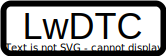

LwDTC |version| documentation
=============================

Welcome to the documentation for version |version|.

LwDTC is lightweight, platform independent library for date, time and cron utility management.

Main motivation comes from the necessity of simple cron for my own personal home automation project, with ``1`` second granularity.

.. rst-class:: center
.. rst-class:: index_links

    :ref:`download_library` :ref:`getting_started` `Open Github <https://github.com/MaJerle/lwdtc>`_ `Donate <https://paypal.me/tilz0R>`_

Features
^^^^^^^^

* Written in ANSI C99
* Platform independent, easy to use
* Support for date, time and cron utilities
* Ultra-lightweight cron library for embedded systems
* Cron supports numbers only, no string dates/months, quicker parsing
* Support for `time.h` `struct tm` data structure for time operations
* Date and time range support with CRON syntax
* User friendly MIT license

Requirements
^^^^^^^^^^^^

* C compiler
* Few *kB* of non-volatile memory

Contribute
^^^^^^^^^^

Fresh contributions are always welcome. Simple instructions to proceed:

#. Fork Github repository
#. Respect `C style & coding rules <https://github.com/MaJerle/c-code-style>`_ used by the library
#. Create a pull request to ``develop`` branch with new features or bug fixes

Alternatively you may:

#. Report a bug
#. Ask for a feature request

License
^^^^^^^

.. literalinclude:: ../LICENSE

Table of contents
^^^^^^^^^^^^^^^^^

.. toctree::
    :maxdepth: 2
    :caption: Contents

    self
    get-started/index
    user-manual/index
    api-reference/index
    changelog/index

.. toctree::
    :maxdepth: 2
    :caption: Other projects
    :hidden:

    LwBTN - Button manager <https://github.com/MaJerle/lwbtn>
    LwDTC - DateTimeCron <https://github.com/MaJerle/lwdtc>
    LwESP - ESP-AT library <https://github.com/MaJerle/lwesp>
    LwEVT - Event manager <https://github.com/MaJerle/lwevt>
    LwGPS - GPS NMEA parser <https://github.com/MaJerle/lwgps>
    LwGSM - GSM-AT library <https://github.com/MaJerle/lwgsm>
    LwJSON - JSON parser <https://github.com/MaJerle/lwjson>
    LwMEM - Memory manager <https://github.com/MaJerle/lwmem>
    LwOW - OneWire with UART <https://github.com/MaJerle/lwow>
    LwPKT - Packet protocol <https://github.com/MaJerle/lwpkt>
    LwPRINTF - Printf <https://github.com/MaJerle/lwprintf>
    LwRB - Ring buffer <https://github.com/MaJerle/lwrb>
    LwSHELL - Shell <https://github.com/MaJerle/lwshell>
    LwUTIL - Utility functions <https://github.com/MaJerle/lwutil>
    LwWDG - RTOS task watchdog <https://github.com/MaJerle/lwwdg>